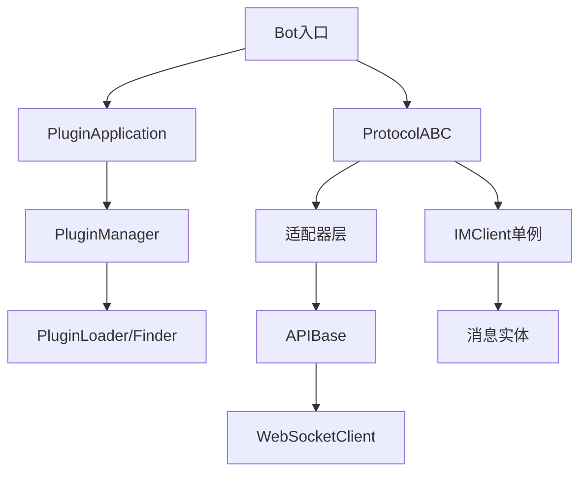

# IMClient Bot SDK - 开发者文档

## 项目架构与模块化状态

### 项目结构说明

```tree
src/
├── abc/                    # 核心抽象层 - 稳定的接口定义
│   ├── api_base.py        # 纯通信层抽象，自动包装API方法
│   └── protocol_abc.py    # 最小协议抽象层，固定接口签名
├── adapters/              # 协议适配器实现 - 可独立替换
│   └── napcat/           # NapCat协议实现（独立包嵌入）
├── connector/             # 连接器层 - 独立网络组件
│   ├── abc.py            # WebSocket抽象接口
│   └── wsclient.py       # WebSocket客户端实现（独立包嵌入）
├── core/                  # 核心业务逻辑
│   ├── client.py         # IMClient单例，协议代理
│   ├── IM.py             # 消息实体类（User, Group, Message等）
│   ├── nodes.py          # 消息节点系统
│   └── plugin.py         # Bot插件基类（桥接插件系统）
├── plugins_system/        # 完整插件系统（独立包嵌入）
│   ├── abc/              # 插件系统抽象接口
│   ├── core/             # 核心类（Plugin, Event, PluginContext）
│   ├── implementations/  # 默认实现
│   ├── managers/         # 管理器
│   └── utils/            # 工具和类型定义
├── utils/                 # 通用工具函数
└── sys_plugin/           # 系统自带插件（内置功能扩展）
```

### 模块化状态

| 模块               | 状态   | 说明                            |
| ------------------ | ------ | ------------------------------- |
| `abc/`             | 稳定   | 核心抽象接口，向后兼容          |
| `connector/`       | 稳定   | 独立WebSocket客户端，可单独使用 |
| `plugins_system/`  | 稳定   | 完整插件系统，功能完备          |
| `adapters/napcat/` | 开发中 | 协议实现，功能覆盖中            |
| `core/`            | 开发中 | 核心逻辑，API仍在完善           |
| `sys_plugin/`      | 实验性 | 系统插件，功能验证阶段          |

### 依赖关系图



## 插件系统详解

### 插件系统架构

插件系统是一个独立的、完整的组件，包含以下核心部分：

#### 1. 核心类

- **Plugin**: 插件基类，使用 `PluginMeta` 元类自动注册
- **PluginContext**: 插件运行上下文，提供事件总线和资源访问
- **PluginManager**: 插件生命周期管理器
- **EventBus**: 事件总线，支持发布-订阅和请求-响应模式

#### 2. 默认实现

```python
# 事件总线实现
SimpleEventBus:        # 简单同步事件总线
NonBlockingEventBus:   # 非阻塞事件总线，支持队列

# 插件管理器
DefaultPluginManager:  # 标准插件管理器
DefaultPluginLoader:   # 默认插件加载器
DefaultPluginFinder:   # 默认插件查找器
```

#### 3. 自定义插件系统

```python
from plugins_system.abc import PluginManager, PluginLoader, PluginFinder
from plugins_system.core.plugins import Plugin

class CustomPluginManager(PluginManager):
    """自定义插件管理器"""

    async def load_plugins(self) -> List[Plugin]:
        # 自定义加载逻辑
        pass

    async def unload_plugin(self, plugin_name: str) -> bool:
        # 自定义卸载逻辑
        pass

class CustomEventBus(EventBus):
    """自定义事件总线"""

    def publish(self, event: str, data: Any = None, **kwargs) -> None:
        # 自定义发布逻辑，可集成外部消息队列
        pass

    async def request(self, event: str, data: Any = None, **kwargs) -> Dict:
        # 自定义请求-响应逻辑
        pass
```

### 插件混入类 (PluginMixin)

混入类是为插件提供可复用功能的扩展机制。

#### 1. 现有混入类

```python
# plugins_system/mixins/server.py
ServiceMixin:  # 服务注册与发现
    - register_service()     # 注册RPC式服务
    - call_service()         # 调用其他插件服务
    - set_service_state()    # 管理服务状态
```

#### 2. 编写自定义混入类

```python
from plugins_system.core.mixin import PluginMixin
from dataclasses import dataclass
from typing import Dict, Any

class DatabaseMixin(PluginMixin):
    """数据库访问混入类"""

    def __init__(self, *args, **kwargs):
        super().__init__(*args, **kwargs)
        self._connections: Dict[str, Any] = {}

    async def connect_database(self, name: str, conn_str: str) -> bool:
        """连接到数据库"""
        try:
            # 实际的数据库连接逻辑
            conn = await self._create_connection(conn_str)
            self._connections[name] = conn
            self.logger.info(f"数据库连接 '{name}' 已建立")
            return True
        except Exception as e:
            self.logger.error(f"数据库连接失败: {e}")
            return False

    def get_connection(self, name: str) -> Any:
        """获取数据库连接"""
        return self._connections.get(name)

    async def on_mixin_load(self):
        """混入类加载时的回调"""
        self.logger.debug("DatabaseMixin 加载完成")

    async def on_mixin_unload(self):
        """混入类卸载时的回调"""
        # 清理所有数据库连接
        for name, conn in self._connections.items():
            await conn.close()
        self._connections.clear()
        self.logger.debug("DatabaseMixin 已卸载")

# 使用混入类
class MyPlugin(Plugin, DatabaseMixin):
    """使用混入类的插件"""

    async def on_load(self):
        # 混入类的方法自动可用
        await self.connect_database("main", "sqlite:///data.db")

        # 注册事件处理器
        self.register_handler("user.query", self.handle_user_query)

    async def handle_user_query(self, event):
        conn = self.get_connection("main")
        # 使用数据库连接处理查询
        result = await conn.execute("SELECT * FROM users")
        return result
```

#### 3. 混入类生命周期

1. **初始化**: `__init__()` - 混入类与插件同时初始化
2. **加载**: `on_mixin_load()` - 插件加载时调用
3. **使用**: 插件运行时混入类方法可用
4. **卸载**: `on_mixin_unload()` - 插件卸载时调用

### 延迟装饰器解析器 (LazyDecoratorResolver)

延迟装饰器解析器允许在插件加载时动态注册处理器，而不是在导入时。

#### 1. 工作原理

```python
# 传统方式 - 导入时立即注册
@event_handler("message.group")
async def handle_message(event):
    pass

# 延迟方式 - 插件加载时注册
@service("user.query")
async def query_user(event):
    pass
```

#### 2. 内置解析器

```python
# plugins_system/mixins/server.py
ServiceResolver:  # 服务注册装饰器解析器
    - 标签: "service"
    - 必需混入类: ServiceMixin
    - 功能: 将方法注册为可调用服务
```

#### 3. 创建自定义解析器

```python
from plugins_system.core.lazy_resolver import LazyDecoratorResolver

class TaskSchedulerResolver(LazyDecoratorResolver):
    """定时任务装饰器解析器"""

    tag = "scheduled_task"  # 装饰器标签
    space = "scheduler"     # 命名空间，避免冲突

    def __init__(self):
        super().__init__()
        self.required_mixin = TimerMixin  # 需要TimerMixin混入类

    def check(self, plugin: Plugin, func: Callable, event_bus: EventBus) -> bool:
        """检查是否应该处理此装饰器"""
        # 检查插件是否有TimerMixin
        return plugin.has_mixin(TimerMixin)

    def handle(self, plugin: Plugin, func: Callable, event_bus: EventBus) -> None:
        """处理装饰器逻辑"""
        try:
            # 从装饰器参数获取元数据
            interval = self.kwd.get("interval", 60)
            start_now = self.kwd.get("start_now", True)

            # 注册定时任务
            plugin.register_scheduled_task(
                func=func,
                interval=interval,
                start_now=start_now
            )

            plugin.logger.info(f"定时任务注册成功: {func.__name__} (间隔: {interval}s)")
        finally:
            self.clear_cache()  # 清理缓存

# 使用装饰器
def scheduled_task(interval: int = 60, start_now: bool = True):
    """定时任务装饰器工厂"""
    return LazyDecoratorResolver.create_decorator(
        tag="scheduled_task",
        space="scheduler",
        interval=interval,
        start_now=start_now
    )

# 在插件中使用
class MyPlugin(Plugin, TimerMixin):

    @scheduled_task(interval=300)  # 每5分钟执行
    async def backup_data(self):
        """定时备份数据"""
        self.logger.info("执行数据备份...")
```

#### 4. 解析器工作流程

1. **标记**: 装饰器标记函数但不立即执行
2. **收集**: 插件加载时收集所有标记的函数
3. **解析**: 调用相应的解析器处理每个标记
4. **注册**: 解析器将函数注册到相应系统
5. **清理**: 解析器清理缓存数据

### 事件系统

#### 1. 事件类型

```python
# 内置系统事件
SystemEvents.PLUGIN_LOADED      # 插件加载完成
SystemEvents.PLUGIN_UNLOADED    # 插件卸载完成
SystemEvents.ALL_PLUGINS_LOADED # 所有插件加载完成

# 自定义事件
"message.group"     # 群消息
"message.private"   # 私聊消息
"notice.friend_add" # 好友添加通知
```

#### 2. 事件处理器

```python
# 同步处理器
def sync_handler(event: Event) -> Any:
    return {"processed": True}

# 异步处理器
async def async_handler(event: Event) -> Any:
    await asyncio.sleep(0.1)
    return {"processed": True}

# 正则匹配处理器
import re
pattern = re.compile(r"message\.(group|private)")
bus.register_handler(pattern, handler)
```

#### 3. 事件拦截器

```python
from plugins_system.core.events import EventInterceptor

class RateLimitInterceptor:
    """速率限制拦截器"""

    def __init__(self, limit: int = 10, window: int = 60):
        self.limit = limit
        self.window = window
        self.counts: Dict[str, List[float]] = {}

    async def __call__(self, event: Event) -> bool | Event | None:
        """拦截器调用"""
        key = f"{event.source}:{event.event}"
        now = time.time()

        # 清理过期计数
        if key in self.counts:
            self.counts[key] = [t for t in self.counts[key] if now - t < self.window]

        # 检查是否超限
        if len(self.counts.get(key, [])) >= self.limit:
            event.metadata["rate_limited"] = True
            return False  # 拦截事件

        # 记录事件
        self.counts.setdefault(key, []).append(now)
        return True  # 允许通过

# 注册拦截器
interceptor_id = event_bus.register_interceptor(RateLimitInterceptor())
```

## 编写适配器实现

### 适配器架构

适配器负责将通用协议抽象映射到具体协议实现。

#### 1. 必须实现的接口

```python
from abc import ABC, abstractmethod
from typing import List, Dict, Any, Optional

class ProtocolABC(ABC):
    """协议抽象基类"""

    @property
    @abstractmethod
    def api(self) -> "APIBase":
        """获取API实例"""

    @property
    @abstractmethod
    def self_id(self) -> str:
        """获取Bot账户ID"""

    @abstractmethod
    async def send_group_message(self, gid: str, content: "MessageContent"):
        """发送群消息"""

    @abstractmethod
    async def send_private_message(self, uid: str, content: "MessageContent"):
        """发送私聊消息"""

    @abstractmethod
    async def login(self, url: str, token: str, **kwargs) -> "ABCWebSocketClient":
        """登录并建立连接"""

    @abstractmethod
    def _parse_event(self, raw_data) -> Optional["Event"]:
        """解析原始事件"""

    # ... 其他必须实现的方法
```

#### 2. 创建新适配器

```python
# 1. 创建适配器目录结构
adapters/
└── my_protocol/
    ├── __init__.py      # 导出适配器类
    ├── protocol.py      # 协议实现
    ├── api.py          # API封装
    ├── api_base.py     # API基类
    ├── message.py      # 消息相关API
    ├── user.py         # 用户相关API
    └── group.py        # 群组相关API

# 2. 实现API基类
# adapters/my_protocol/api_base.py
from src.abc.api_base import APIBase, ApiRequest

class MyProtocolAPIBase(APIBase):
    """MyProtocol API基类"""

    protocol_name = "my_protocol"

    def __init__(self):
        super().__init__()
        self.client = None

    def to_protocol_format(self, request: ApiRequest) -> Dict[str, Any]:
        """转换为协议格式"""
        return {
            "cmd": request.activity,
            "args": request.data,
            "headers": request.headers or {}
        }

    async def invoke(self, request: ApiRequest) -> Any:
        """执行API调用"""
        if not self.client:
            raise RuntimeError("客户端未初始化")

        protocol_request = self.to_protocol_format(request)
        response = await self.client.send_and_wait(protocol_request)
        return self._parse_response(response)

    def _parse_response(self, response: Dict[str, Any]) -> Any:
        """解析响应"""
        if response.get("status") == "success":
            return response.get("data", {})
        else:
            raise RuntimeError(f"API调用失败: {response.get('error')}")

# 3. 实现协议类
# adapters/my_protocol/protocol.py
from src.abc.protocol_abc import ProtocolABC, RawMessage, RawUser, RawGroup
from .api import MyProtocolAPI

class MyProtocol(ProtocolABC):
    """MyProtocol实现"""

    protocol_name = "my_protocol"

    def __init__(self):
        self._api = MyProtocolAPI()
        self._self_id = ""

    @property
    def api(self) -> MyProtocolAPI:
        return self._api

    @property
    def self_id(self) -> str:
        return self._self_id

    async def login(self, url: str, token: str, **kwargs):
        """登录实现"""
        # 1. 建立连接
        client = await self._connect_to_server(url, token)

        # 2. 身份验证
        auth_result = await self._authenticate(token)

        # 3. 获取自身信息
        self._self_id = auth_result["user_id"]

        return client

    async def send_group_message(self, gid: str, content: "MessageContent"):
        """发送群消息实现"""
        # 转换为协议特定格式
        message_format = self._content_to_protocol_format(content)

        # 调用API
        response = await self._api.group.send_message(
            group_id=gid,
            message=message_format
        )

        return response

    def _parse_event(self, raw_data: tuple) -> Optional["Event"]:
        """解析事件"""
        raw_str, msg_type = raw_data

        try:
            data = json.loads(raw_str)
        except json.JSONDecodeError:
            return None

        # 解析协议特定事件
        event_type = data.get("type")

        if event_type == "message":
            return self._parse_message_event(data)
        elif event_type == "notice":
            return self._parse_notice_event(data)
        elif event_type == "meta":
            return self._parse_meta_event(data)

        return None

    # ... 实现其他抽象方法

# 4. 注册适配器
# adapters/my_protocol/__init__.py
from .protocol import MyProtocol
from .api import MyProtocolAPI

__all__ = ["MyProtocol", "MyProtocolAPI"]

# 自动注册到ProtocolMeta
# 注意：协议类必须定义protocol_name属性
```

#### 3. 适配器可以做什么

1. **消息收发**

   - 文本、图片、文件等多媒体消息
   - @提及、回复、引用等富文本功能
   - 消息撤回、编辑、转发
2. **联系人管理**

   - 好友列表获取、添加、删除
   - 群组列表获取、创建、解散
   - 群成员管理（踢人、禁言、设管理）
3. **事件处理**

   - 消息事件、通知事件、请求事件
   - 元事件（连接、心跳等）
   - 自定义扩展事件
4. **扩展功能**

   - 文件上传下载
   - 语音视频处理
   - 小程序/卡片消息
   - 系统状态查询

#### 4. 适配器最佳实践

```python
class WellStructuredProtocol(ProtocolABC):
    """良好结构的适配器示例"""

    def __init__(self):
        # 1. 初始化API层
        self._api = MyProtocolAPI()

        # 2. 初始化状态
        self._self_id = ""
        self._connected = False

        # 3. 初始化缓存
        self._user_cache: Dict[str, User] = {}
        self._group_cache: Dict[str, Group] = {}

        # 4. 初始化连接
        self._ws_client = None

    async def login(self, url: str, token: str, **kwargs):
        """登录实现 - 包含错误处理和状态管理"""
        try:
            # 建立连接
            self._ws_client = await self._create_connection(url, token)

            # 验证身份
            auth_data = await self._authenticate(token)

            # 更新状态
            self._self_id = auth_data["user_id"]
            self._connected = True

            # 初始化缓存
            await self._warmup_caches()

            # 返回客户端
            return self._ws_client

        except ConnectionError as e:
            self.logger.error(f"连接失败: {e}")
            raise
        except AuthenticationError as e:
            self.logger.error(f"认证失败: {e}")
            raise
        except Exception as e:
            self.logger.error(f"登录过程中未知错误: {e}")
            raise

    def _content_to_protocol_format(self, content: MessageContent) -> List[Dict]:
        """消息内容转换 - 保持可扩展性"""
        segments = []

        for node in content.nodes:
            if isinstance(node, TextNode):
                segments.append(self._text_node_to_segment(node))
            elif isinstance(node, ImageNode):
                segments.append(self._image_node_to_segment(node))
            elif isinstance(node, AtNode):
                segments.append(self._at_node_to_segment(node))
            # ... 其他节点类型

        return segments

    def _text_node_to_segment(self, node: TextNode) -> Dict:
        """文本节点转换 - 单一职责"""
        segment = {
            "type": "text",
            "data": {"text": node.content}
        }

        # 处理样式
        if node.bold:
            segment["data"]["bold"] = True
        if node.italic:
            segment["data"]["italic"] = True

        return segment

    async def _warmup_caches(self):
        """预热缓存 - 异步初始化"""
        # 并行获取常用数据
        tasks = [
            self.fetch_friends(),
            self.fetch_groups(),
        ]

        results = await asyncio.gather(*tasks, return_exceptions=True)

        # 处理结果
        for i, result in enumerate(results):
            if isinstance(result, Exception):
                self.logger.warning(f"缓存预热失败: {result}")
            elif i == 0:  # 好友列表
                self._cache_users(result)
            elif i == 1:  # 群组列表
                self._cache_groups(result)

    def _cache_users(self, users_data):
        """缓存用户数据"""
        for user_data in users_data:
            user = self._parse_user(user_data)
            self._user_cache[user.uid] = user

    async def fetch_user_with_cache(self, uid: str) -> User:
        """带缓存的用户获取"""
        # 检查缓存
        if uid in self._user_cache:
            return self._user_cache[uid]

        # 缓存未命中，从API获取
        user_data = await self.api.user.get_info(uid)
        user = self._parse_user(user_data)

        # 更新缓存
        self._user_cache[uid] = user

        return user
```

## 系统插件 (sys_plugin)

系统插件是框架自带的功能扩展，位于 `sys_plugin/` 目录。

### 现有系统插件

```python
# sys_plugin/test.py - 插件系统测试插件
class TestPlugin(Plugin):
    """测试插件，验证插件系统基本功能"""
    name = 'test'
    version = '1'
    authors = 'Fish-LP'

    async def on_load(self):
        self.logger.info("测试插件已加载")
        # 注册测试事件处理器
        self.register_handler("test.message", self.handle_test)

    async def handle_test(self, event):
        self.logger.info(f"收到测试消息: {event.data}")
        return {"status": "ok"}
```

### 添加系统插件

1. **创建插件文件**

   ```python
   # sys_plugin/health_check.py
   from src import Plugin
   import psutil

   class HealthCheckPlugin(Plugin):
       """系统健康检查插件"""
       name = 'health_check'
       version = '1.0.0'
       authors = ['System']

       async def on_load(self):
           self.register_handler("system.health.check", self.check_health)
           self.register_handler("system.metrics.get", self.get_metrics)

       async def check_health(self, event):
           """检查系统健康状态"""
           return {
               "cpu_percent": psutil.cpu_percent(),
               "memory_percent": psutil.virtual_memory().percent,
               "disk_percent": psutil.disk_usage('/').percent,
               "timestamp": time.time()
           }

       async def get_metrics(self, event):
           """获取系统指标"""
           return {
               "plugins_loaded": len(self.plugin_manager.list_plugins()),
               "event_handlers": self.event_bus.get_handler_count(),
               "uptime": time.time() - self._start_time
           }
   ```

2. **启用系统插件**

   ```python
   # 在Bot初始化时自动包含sys_plugin目录
   plugin_dirs = [Path("sys_plugin")] + user_plugin_dirs
   ```

### 系统插件规范

1. **命名规范**: 使用蛇形命名法，如 `health_check.py`
2. **插件类名**: 以 `Plugin` 结尾，如 `HealthCheckPlugin`
3. **权限控制**: 系统插件可访问内部API，但应谨慎使用
4. **错误处理**: 必须包含完整的错误处理，避免影响主系统
5. **资源管理**: 及时释放资源，避免内存泄漏

## 开发工作流

### 1. 环境设置

```bash
# 1. 克隆项目
git clone <repository>
cd imclient-bot

# 2. 创建虚拟环境
python -m venv venv
source venv/bin/activate  # Linux/Mac
# 或
venv\Scripts\activate     # Windows

# 3. 安装开发依赖
pip install -e .[dev]

# 4. 安装预提交钩子
pre-commit install
```

### 2. 代码规范

```bash
# 代码格式化
black src/ tests/

# 代码检查
flake8 src/

# 类型检查
mypy src/

# 导入排序
isort src/

# 安全检查
bandit -r src/
```

### 3. 测试

```python
# 单元测试结构
tests/
├── unit/
│   ├── test_abc.py          # 抽象层测试
│   ├── test_protocol.py     # 协议测试
│   └── test_plugins.py      # 插件系统测试
├── integration/
│   ├── test_bot_integration.py
│   └── test_plugin_integration.py
└── fixtures/               # 测试夹具
```

### 4. 发布流程

1. **版本管理**

   ```python
   # meta.py
   __version__ = "5.0.0-dev.0"  # 开发版
   __version__ = "5.0.0-rc.1"   # 候选版
   __version__ = "5.0.0"        # 正式版
   ```

2. **变更日志**

   ```tree
   CHANGELOG.md
   ├── [Unreleased]
   ├── 5.0.0 - 2024-01-01
   │   ├── Added: 新功能
   │   ├── Changed: 不兼容变更
   │   └── Fixed: Bug修复
   └── 4.0.0 - 2023-12-01
   ```

## 故障排除

### 常见问题

1. **插件加载失败**

   ```text
   原因: 插件依赖缺失或版本不兼容
   解决: 检查dependency字段，安装正确版本
   ```

2. **事件处理器不触发**

   ```text
   原因: 事件名称不匹配或处理器未注册
   解决: 检查事件总线日志，确认事件发布
   ```

3. **协议连接断开**

   ```text
   原因: 网络问题或协议实现错误
   解决: 检查WebSocket连接日志，实现重连逻辑
   ```

### 调试技巧

```python
# 1. 启用调试日志
import logging
logging.basicConfig(level=logging.DEBUG)

# 2. 使用调试器
import pdb
pdb.set_trace()

# 3. 事件总线监控
class DebugEventBus(SimpleEventBus):
    def publish(self, event, data=None, **kwargs):
        print(f"[EventBus] 发布事件: {event}")
        super().publish(event, data, **kwargs)

# 4. 协议调试
class DebugProtocol(ProtocolABC):
    def _parse_event(self, raw_data):
        print(f"[Protocol] 原始数据: {raw_data}")
        return super()._parse_event(raw_data)
```

## 贡献指南

### 开发流程

1. **功能开发**

   - 从 `develop` 分支创建特性分支
   - 编写测试用例
   - 实现功能代码
   - 更新文档
2. **协议适配器开发**

   - 参考 `adapters/napcat/` 实现
   - 编写协议规范文档
   - 提供示例配置
3. **插件系统扩展**

   - 保持向后兼容
   - 添加类型注解
   - 编写使用示例

### 代码审查要点

1. **架构一致性**

   - 是否符合抽象接口
   - 是否有循环依赖
2. **测试覆盖**

   - 单元测试是否完整
   - 集成测试是否覆盖边缘情况
3. **文档完整性**

   - API文档是否更新
   - 示例代码是否正确

## 路线图

### 短期目标 (v5.1.0)

- [ ]  完善NapCat协议实现
- [ ]  添加更多系统插件
- [ ]  优化插件热重载
- [ ]  完善Type Hint覆盖

### 中期目标 (v6.0.0)

- [ ]  支持多协议并行运行
- [ ]  插件市场机制
- [ ]  图形化管理界面
- [ ]  性能监控体系

### 长期愿景

- [ ]  跨平台客户端SDK
- [ ]  云原生部署支持
- [ ]  AI插件生态
- [ ]  社区驱动发展

---

**文档版本**: 2025.12.20

> 注意：本文档面向开发者，API和架构可能随版本更新而变更，请始终参考最新代码和文档。
